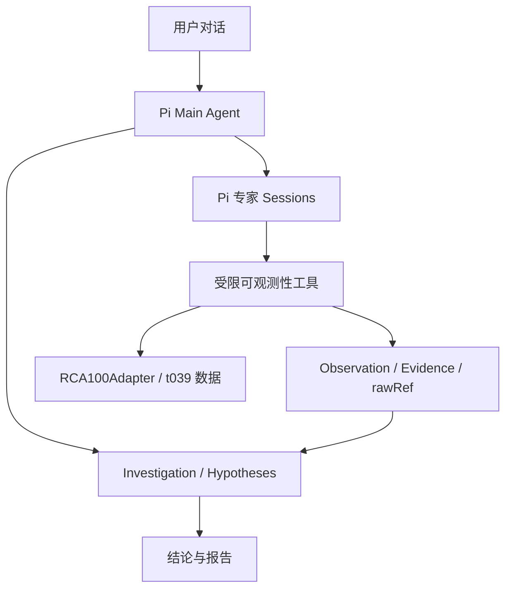

# AIOps RCA Investigation Workspace

基于 Pi Agent 的多 Agent 根因分析工作台。用户通过对话发起调查；Main Agent 管理假设、决定取证方向并综合结论，Trace、Metrics、Log、Event / Topology 专家 Agent 分别执行专项取证。工具结果以 Observation 和 Evidence 持久化，支持在调查结束后继续追问。

**在线演示：** [Pi Ops](https://pi-chat-rca-production.up.railway.app/)

> 当前是面向 RCA100 `t039` 案例的工程原型。数据适配器读取 RCA100 遥测文件；仓库尚未接入生产 Prometheus、Loki、Tempo 或 Kubernetes。运行调查需要可用的模型 Provider 和相应案例数据。

## 功能概览

| 能力 | 当前实现 |
| --- | --- |
| 假设驱动调查 | Main Agent 创建、更新和检验候选假设，并在结案时交代支持、排除和未解决的解释。 |
| 专项取证 | Trace、Metrics、Log、Event / Topology 专家运行于独立 Pi Session，调用受限的可观测性工具。 |
| 可追溯证据 | 工具调用、Observation、Evidence 和 `rawRef` 持久化；大结果在进入模型上下文前压缩。 |
| 调查生命周期 | 支持取消、用户补充信息、服务重启后的中断恢复、历史会话和后续追问。 |
| 对话工作台 | 通过 SSE 展示消息、工具调用、专家任务、假设、调查详情和 Markdown 报告。 |
| 独立评估 | 评分 CLI 在调查结束后读取 Ground Truth；Agent 运行时不读取答案文件。 |

Main Agent 的调查步骤由模型依据当前状态和证据决定；服务端负责工具权限、预算、状态校验与持久化。专家提供发现和证据，最终 RCA 结论由 Main Agent 形成并经服务端校验。

## 架构



独立评分进程在报告完成后读取答案文件；答案目录不传给 Agent Runtime。具体的工具、证据和调查约束见 [t039 调查说明](docs/rca-t039.md)。

## 快速开始

### 环境要求

- Node.js 22.19 或兼容的 22.x 版本；
- Corepack 与 pnpm 11.22.0（仓库 `packageManager` 指定版本）；
- 下载 t039 数据时需要 Git 和 Git LFS；
- 至少一个可用的 Pi 模型 Provider 及其凭据。

在仓库根目录执行：

```bash
corepack enable
pnpm install --frozen-lockfile
cp apps/pi-chat/.env.example apps/pi-chat/.env
```

Windows PowerShell 可用 `Copy-Item apps/pi-chat/.env.example apps/pi-chat/.env`；下载脚本和下文的环境变量示例使用 Bash，Windows 上可在 Git Bash 或 WSL 中运行。

按需编辑 `apps/pi-chat/.env`。如果使用项目内置的 PackyAPI 配置入口，可设置 `PACKY_API_KEY`，并按需指定 `PACKY_BASE_URL`、`PACKY_MODEL_ID`；也可以使用现有的 Pi 模型配置。不要将凭据提交到 Git。

本地开发启动：

```bash
pnpm dev:pi-chat
```

打开 Vite 输出的前端地址（默认 [http://localhost:5173](http://localhost:5173)）。Hono API 默认监听 `127.0.0.1:4328`，前端通过 Vite 代理访问 `/api`。健康检查为 `GET /api/system/health`。

默认会话数据写入 Pi Agent 目录下的 `pi-chat` 子目录；可用 `PI_CHAT_ROOT_DIR` 覆盖。调查目录可单独用 `RCA_INVESTIGATIONS_DIR` 指定，路径配置以 [`server/config.ts`](apps/pi-chat/server/config.ts) 为准。

### 准备 t039 演示数据

在仓库根目录执行：

```bash
pnpm --filter pi-chat rca:fetch:t039
```

脚本只下载 RCA100 `t039` 的 Agent 可见案例文件，保存到 `apps/pi-chat/.rca-data/cases/t039/`，并保留上游许可文件；不会下载答案目录。然后在 `apps/pi-chat/.env` 中设置：

```dotenv
RCA100_CASES_DIR=.rca-data/cases
```

启动后可在对话中输入“帮我排查 t039 的根因”。数据来源、文件结构与隔离规则见 [`docs/rca-t039.md`](docs/rca-t039.md)。

## 数据与评估边界

Conversation Record、Pi Session 文件和 Investigation 状态分别持久化。调查目录包含 `investigation.json`、`tool-calls.jsonl`、`events.jsonl`；完成调查后生成 `final-report.json` 和 `final-report.md`，执行评分后才生成 `evaluation.json`。进程重启时，未完成的调查会被标记为 `interrupted`，可利用已有证据继续处理。

Ground Truth 仅供独立评分命令使用。请将 `RCA100_ANSWER_KEY_DIR` 只提供给该命令，不要配置到运行 Agent 的服务进程：

```bash
cd apps/pi-chat
RCA100_ANSWER_KEY_DIR=/absolute/path/to/RCA100/answer_key \
RCA_INVESTIGATIONS_DIR=/absolute/path/to/investigations \
pnpm rca:evaluate INV-...
```

评分结果输出到终端，并写入对应 Investigation 的 `evaluation.json`。

## 开发与部署

在仓库根目录运行：

```bash
pnpm --filter pi-chat typecheck
pnpm --filter pi-chat lint
pnpm --filter pi-chat test
pnpm --filter pi-chat build
```

GitHub Actions 对应用代码的 Pull Request 及 `main` 分支执行上述检查。Railway 从 `main` 分支使用根目录 [`Dockerfile`](Dockerfile) 构建；容器构建期间下载 t039 数据。生产环境应将 `PI_CHAT_ROOT_DIR` 和 `RCA_INVESTIGATIONS_DIR` 指向持久化卷，以保留会话与调查记录。部署配置见 [`railway.json`](railway.json) 和 [启动脚本](apps/pi-chat/scripts/start-railway.sh)。

## 仓库结构

| 路径 | 内容 |
| --- | --- |
| [`apps/pi-chat/src/`](apps/pi-chat/src/) | React 对话工作台与 SSE 会话状态 |
| [`apps/pi-chat/server/conversation/`](apps/pi-chat/server/conversation/) | Pi 会话、历史记录和 Runtime 生命周期 |
| [`apps/pi-chat/server/rca/`](apps/pi-chat/server/rca/) | 调查服务、专家 Profile、工具、数据适配与评分 |
| [`apps/pi-chat/server/routes/`](apps/pi-chat/server/routes/) | 对话、系统与 RCA HTTP 路由 |
| [`docs/`](docs/) | 设计规格及 t039 案例说明 |

## 设计文档

- [RCA100 t039 调查与数据隔离](docs/rca-t039.md)
- [调查预算规格](docs/rca-budget-spec.md)
- [专家 Runtime 可观测性](docs/rca-expert-runtime-observability.md)
- [会话生命周期规格](docs/conversation-session-lifecycle-spec.md)

项目的包元数据声明 ISC 许可证，见 [`package.json`](package.json)。
