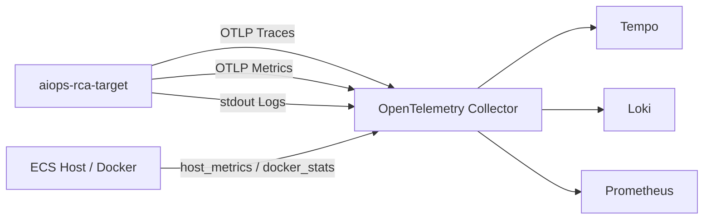

# AIOps Target Observability Baseline

`target/production-baseline` 是 **被观测 Target 系统及其 OpenTelemetry 可观测性基线分支**。

本分支的重点不是 RCA100 离线调查，也不是 Railway 上的 main RCA 消费端，而是让 Target 真实输出可供 RCA 系统消费的 Trace、Log 与 Metrics，并验证三信号在 Tempo、Loki、Prometheus 中的基础链路。

> main 分支负责 RCA Investigation / Agent Runtime / Live Observability 消费端；本分支负责 Target 侧埋点、生命周期语义和采集链路。两者不要混为同一运行时。

## 当前能力

Target 当前已实现：

| 能力 | 当前状态 |
| --- | --- |
| Agent / Model Turn / Provider / Tool Trace | 已实现 |
| 生命周期结构化日志 | 已实现 |
| Agent / Model / Provider / Tool 应用指标 | 已实现 |
| Host / Docker 基础设施指标 | 已接入 Collector |
| OTLP Trace 导出 | 已实现 |
| OTLP Metrics 导出 | 已实现 |
| Loki 日志采集 | 已接入 |
| Tempo Trace 存储 | 已接入 |
| Prometheus Metrics 存储 | 已接入 |
| Provider generation lifecycle | 可用 |
| Provider SDK 内部 attempt lifecycle | 不可用 |
| Exemplar | 不可用 |

Provider 生命周期必须区分：

- `pi.provider.generation` 表示一次顶层 Pi provider generation；
- response-header latency 与完整 generation duration 分开记录；
- generation 可能包含 Provider SDK 内部 retry，**不能把 generation 当成 attempt**；
- 当前 Pi 扩展层没有稳定的 provider-internal attempt identity，因此不伪造 attempt 指标；
- 当前锁定 OTel Metrics 路径真实 probe 为 `exemplars=false`。

公共语义见 [Telemetry Contract v1](docs/telemetry-contract-v1.md)。

## 架构



当前 Collector 的职责：

- 接收 Target OTLP Trace；
- 接收 Target OTLP Application Metrics；
- 采集 Target Docker stdout/stderr；
- 采集 ECS Host Metrics；
- 采集 Docker Container Metrics；
- 将 Trace 发送到 Tempo；
- 将 Log 发送到 Loki；
- 通过 Prometheus exporter 暴露 Metrics。

## 应用可观测性

### Trace

主要生命周期包括：

- Agent Run；
- Model Turn；
- Provider Generation；
- Tool Call。

Provider generation Span 使用：

```text
pi.provider.generation
```

不要将其解释为 Provider SDK 内部某一次 retry attempt。

### Metrics

Target 当前应用指标覆盖：

```text
pi_agent_*
pi_model_*
pi_provider_*
pi_tool_*
```

其中 Provider 重点包括：

- generation count；
- generation duration；
- response-header duration。

Metric labels 使用 allowlist 控制基数，未知值归入 `other`。

### Logs

应用继续输出结构化日志到 stdout/stderr，由 Collector 只读取 Target 容器对应的 Docker log directory，再发送到 Loki。

日志可携带 Trace / Span 关联信息，用于 Log ↔ Trace 查询。

## 当前部署形态

当前验证环境采用单台阿里云 ECS：

```text
Alibaba Cloud ECS
├─ aiops-rca-target
├─ otel-collector
├─ tempo
├─ loki
└─ prometheus
```

当前查询后端仅绑定 ECS 本机：

```text
Tempo       127.0.0.1:3200
Loki        127.0.0.1:3100
Prometheus  127.0.0.1:9090
```

这些端口不是给公网直接暴露的接口。

Railway 上的 main RCA Runtime 与该 ECS 不在同一网络，因此不能使用：

```text
http://tempo:3200
http://loki:3100
http://prometheus:9090
```

也不能把 ECS 的 `127.0.0.1` 当作 Railway 可访问地址。

后续 main 消费端应通过受控的 HTTPS / Auth 网络入口访问 Observability Backend，而不是直接裸开放 `3100 / 3200 / 9090`。

## 当前验证边界

目前已经完成的真实运行验证包括：

- Target OpenTelemetry tracing 启动；
- Target OpenTelemetry metrics 启动；
- Tempo Trace 写入与查询；
- Loki Target 日志写入与查询；
- Log ↔ Trace 的 traceId 关联；
- Host / Docker Metrics 暴露；
- Target 应用 Metrics 已通过 Collector 暴露；
- `pi_agent_*` / `pi_model_*` / `pi_provider_*` / `pi_tool_*` 已产生真实数据；
- `exemplars=false` 已通过真实 OTLP payload probe 确认。

仍需严格区分：

```text
CI success
!=
production runtime verified
```

以及：

```text
Collector 可以看到某项 Metric
!=
跨云 RCA Runtime 已经可以查询该 Metric
```

具体代码验证和能力边界见：

- [Target Observability 三信号关联与应用指标规格](docs/target-observability-correlation-spec.md)
- [Target Observability 验证记录](docs/target-observability-validation.md)

## OpenTelemetry 配置

示例配置见 [`apps/pi-chat/.env.example`](apps/pi-chat/.env.example)。

核心变量：

```dotenv
OTEL_SERVICE_NAME=aiops-rca-target
OTEL_EXPORTER_OTLP_ENDPOINT=http://otel-collector:4318

OTEL_METRIC_EXPORT_INTERVAL_MS=15000
OTEL_METRIC_EXPORT_TIMEOUT_MS=5000

# 可选：多实例稳定标识
# OTEL_SERVICE_INSTANCE_ID=target-replica-1

# 可选：限制 Metric label 基数
# OTEL_METRIC_PROVIDER_ALLOWLIST=packy
# OTEL_METRIC_MODEL_ALLOWLIST=deepseek-flash
# OTEL_METRIC_TOOL_ALLOWLIST=utc_time

PI_CHAT_SHUTDOWN_TIMEOUT_MS=10000
```

共享 `OTEL_EXPORTER_OTLP_ENDPOINT` 会用于 Trace 与 Metrics；也可以分别配置：

```dotenv
OTEL_EXPORTER_OTLP_TRACES_ENDPOINT=http://otel-collector:4318/v1/traces
OTEL_EXPORTER_OTLP_METRICS_ENDPOINT=http://otel-collector:4318/v1/metrics
```

不要将 API Key、模型凭据或其他 Secret 提交到仓库。

## Collector / Backend 配置

相关部署配置：

| 路径 | 用途 |
| --- | --- |
| [`deploy/observability/otel-collector.yaml`](deploy/observability/otel-collector.yaml) | OTLP、Target 日志、Host / Docker Metrics 采集与导出 |
| [`deploy/observability/tempo.yaml`](deploy/observability/tempo.yaml) | Tempo 单机 Trace 存储 |
| [`deploy/observability/loki.yaml`](deploy/observability/loki.yaml) | Loki 单机日志存储 |
| [`deploy/observability/prometheus.yaml`](deploy/observability/prometheus.yaml) | Prometheus 抓取 Collector Metrics |

当前 Collector Metrics pipeline 包含：

```text
otlp
host_metrics
docker_stats
```

因此应用指标与基础设施指标走同一个 Collector → Prometheus 暴露链路。

### Target 容器重建后的日志采集

Collector 当前只挂载 **Target 容器实际 Docker log directory**，避免递归采集 Collector / Loki 自身日志。

因此每次重新创建 Target 容器后，都需要重新获取：

```bash
TARGET_LOG_PATH=$(docker inspect -f '{{.LogPath}}' aiops-rca-target)
TARGET_LOG_DIR=$(dirname "$TARGET_LOG_PATH")
```

然后使用新的 `TARGET_LOG_DIR` 重新创建 Collector。

这是当前单机实验部署的已知运维约束，不要假设 Target container ID 永久不变。

## 本地开发

环境要求：

- Node.js 22.19 或兼容的 22.x；
- Corepack；
- pnpm 11.22.0。

安装依赖：

```bash
corepack enable
pnpm install --frozen-lockfile
cp apps/pi-chat/.env.example apps/pi-chat/.env
```

启动：

```bash
pnpm dev:pi-chat
```

默认：

- Web：Vite 输出地址；
- Pi Chat API：`127.0.0.1:4328`；
- 健康检查：`GET /api/system/health`。

本分支仍保留项目原有 RCA 工作台代码用于兼容和验证，但 **Target Observability 是该分支的职责主线**。RCA100 离线调查不是本分支 README 的主要运行路径。

## 开发验证

根据修改范围执行：

```bash
pnpm --filter pi-chat typecheck
pnpm --filter pi-chat lint
pnpm --filter pi-chat test
pnpm --filter pi-chat build
```

生命周期、Telemetry 或 shutdown 修改还应覆盖：

- success / error / cancelled / incomplete；
- duplicate / late callback；
- dangling lifecycle；
- concurrent conversation；
- shutdown / abort；
- Metric completion exactly once；
- label cardinality；
- OTLP payload。

不要用 CI success 代替真实运行验证。

## 仓库结构

| 路径 | 内容 |
| --- | --- |
| [`apps/pi-chat/server/observability/`](apps/pi-chat/server/observability/) | Pi 生命周期 Trace / Metrics / shutdown |
| [`apps/pi-chat/server/telemetry.ts`](apps/pi-chat/server/telemetry.ts) | OTel Provider 初始化与 Resource |
| [`apps/pi-chat/server/conversation/`](apps/pi-chat/server/conversation/) | Pi Session 与 Runtime 生命周期 |
| [`deploy/observability/`](deploy/observability/) | Collector / Tempo / Loki / Prometheus 配置 |
| [`docs/`](docs/) | Contract、Target Spec 与验证记录 |

## 设计文档

- [Telemetry Contract v1](docs/telemetry-contract-v1.md)
- [Target Observability 三信号关联与应用指标规格](docs/target-observability-correlation-spec.md)
- [Target Observability 验证记录](docs/target-observability-validation.md)
- [会话生命周期规格](docs/conversation-session-lifecycle-spec.md)

main RCA Runtime、Live Investigation 消费端和历史 RCA100 调查能力请以 `main` 分支及其对应文档为准。

项目包元数据声明 ISC 许可证，见 [`package.json`](package.json)。
