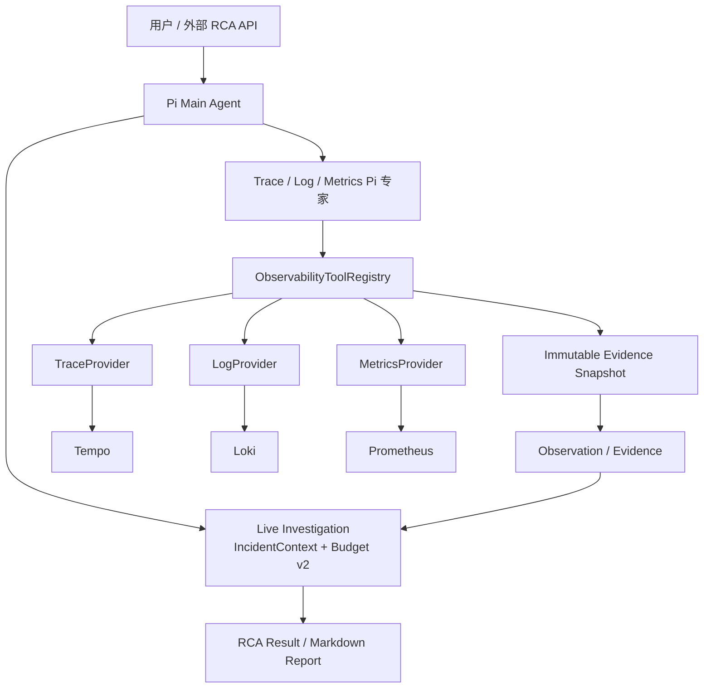

# AIOps Live RCA Investigation Workspace

基于 Pi Agent 的多 Agent AIOps / RCA 工作台。新 Investigation 的生产查询路径使用 **Tempo + Loki + Prometheus**；Main Agent 负责假设、取证计划、反证与最终综合，Trace / Log / Metrics 专家在独立 Pi Session 中执行受限查询。

> Live Observability 迁移基线：`main@8ae4b77a4845b17902e48d3ea5b4af69d13e8516`。  
> 历史 RCA100 Investigation 继续可读，但所有调查写操作由 Service 层返回 `legacy_read_only`。RCA100 adapter、parquet 依赖、下载脚本与评分器已删除，不再维护数据集能力。历史会话只支持查看，发送追问会返回明确停用提示，请新建 Live 会话进行排障。

## 当前架构



Provider 只负责后端协议编译与归一化；HTTP Client 统一处理认证、15 秒总 deadline、真实 AbortSignal、有限重试、每后端并发限制和 4 MiB body 上限；Service / Registry 负责范围授权、Budget、审计、不可变 Evidence 快照与一致提交。

模型不能提供 TraceQL / LogQL / PromQL、任意 backend URL、tenant 或 credential。Telemetry 文本按不可信输入处理，日志中的提示词、URL 或 token 不会获得执行权限。

## Live Investigation

新调查以冻结的 `IncidentContext` 为权威输入：

- `symptom`
- `trigger`
- `target`：service / operation / entity / environment / region / container
- `window`：绝对 UTC 时间窗，或创建时一次性冻结的 lookback

持久化继续使用 `schemaVersion: 2` 的 Budget / generation / terminal protection 语义，同时增加：

```json
{
  "formatVersion": 3,
  "source": {
    "kind": "live",
    "contractVersion": "1"
  }
}
```

不要把 `formatVersion` 当成 Budget capability；现有 Budget v2 的 reservation ledger、Primary / Recovery、每调查并发 3、全局并发 9、Cancel、generation fence 与终态保护继续保留。

## Live 工具

| 模态 | 工具 | 后端 |
| --- | --- | --- |
| Trace | `search_traces`, `get_trace` | Tempo |
| Log | `search_logs` | Loki |
| Metrics | `discover_metrics`, `query_metrics` | Prometheus |

当前 Target 已确认：

- Trace / Logs / Metrics 基础链路存在；
- provider generation 与 response-header latency 是不同概念；
- `exemplars=false`；
- provider attempt lifecycle 不可用；
- 不得把 generation 映射成 attempt。

因此当前 Main Runtime 不声明 Exemplar 或 Provider Attempt 能力。

## 查询边界

服务端强制以下首版上限：

| 项目 | 上限 |
| --- | ---: |
| 查询窗口 | 24h |
| Trace search | 50 traces |
| 单 Trace | 1000 spans |
| Logs | 200 条 |
| 单条日志 | 2048 字符 |
| Metrics | 20 series / 2000 datapoints |
| 单次 Agent Tool 文本 | 32 KiB |
| 单次后端响应 | 4 MiB |
| 单次查询总 deadline | 15s |
| 专家累计结果 | 128 KiB |

任何 partial / truncation / unsupported 都必须显式返回。Live 查询的 `no_data`、timeout 或 unavailable **不会回退 RCA100**。

## 配置

复制环境变量示例：

```bash
cp apps/pi-chat/.env.example apps/pi-chat/.env
```

生产查询 endpoint 必须外部配置，不能写死 Docker service name：

```dotenv
TEMPO_BASE_URL=https://tempo.example.internal
LOKI_BASE_URL=https://loki.example.internal
PROMETHEUS_BASE_URL=https://prometheus.example.internal
```

支持可选 Bearer / Basic Auth / tenant，以及 Loki / Prometheus label mapping，完整字段见 [`apps/pi-chat/.env.example`](apps/pi-chat/.env.example)。

NGINX 网关可使用独立子域名或 BASE_URL 路径前缀；认证、转发和验收步骤见 [Live 查询网关接入](docs/live-gateway-connection.md)。

**部署边界：** 当前 Target / OTel Collector / Tempo / Loki / Prometheus 位于阿里云 ECS，而 main RCA 系统位于 Railway。已知三个查询端口目前只绑定 ECS `127.0.0.1`，所以 Railway 尚无安全可达路径。不要为了验收裸开放 Tempo/Loki/Prometheus 公网端口；应后续配置私网、VPN、受认证反向代理或 Tunnel 后再执行真实只读 smoke。

## 持久化与恢复

`investigation.json` 是 Investigation / Budget 的权威状态。成功 Live 查询先保存有界不可变 Evidence snapshot，再在一次 Budget v2 状态提交中完成 ToolCall 终态与 Observation。

JSONL / UI event、Markdown report 和 visualization 是可重建投影：

- 启动时修复 running Investigation 为 `interrupted`；
- 从权威快照幂等补齐缺失 Tool / Observation / Evidence / Expert / lifecycle event；
- 补齐缺失的 Live `final-report.json` / `final-report.md`；
- 补齐待生成 visualization。

Live 调查恢复时从已提交完成的 Evidence snapshot 恢复 Trace/Metric 查询授权；终态清理内存授权。Expert Evidence 继承实际查询窗口并校验 snapshot-local sourceItems。历史状态支持 offset 分页；Agent 文本按最终序列化字节数限制。

旧 RCA100 Investigation 可以读取报告和历史状态，但不能 resume / dispatch / mutate hypothesis / conclude / cancel / regenerate visualization。

## 开发

环境要求：

- Node.js 22.x；
- Corepack；
- pnpm 11.22.0；
- 至少一个可用的 Pi 模型 Provider。

安装与运行：

```bash
corepack enable
pnpm install --frozen-lockfile
cp apps/pi-chat/.env.example apps/pi-chat/.env
pnpm dev:pi-chat
```

验证：

```bash
pnpm --filter pi-chat typecheck
pnpm --filter pi-chat lint
pnpm --filter pi-chat test
pnpm --filter pi-chat build
```

GitHub Actions 对 Pull Request 与 `main` 执行同一套检查。Railway 使用根目录 [`Dockerfile`](Dockerfile) 构建，生产镜像**不再下载 t039 / RCA100 数据集**。

## 主要目录

| 路径 | 内容 |
| --- | --- |
| `apps/pi-chat/server/rca/live/` | Live HTTP Client 与 Tempo/Loki/Prometheus Provider |
| `apps/pi-chat/server/rca/` | Investigation Service、Budget v2、专家 Runtime、历史记录读取 |
| `apps/pi-chat/server/conversation/` | Pi 会话、历史记录、RCA Conversation context |
| `apps/pi-chat/server/routes/` | 对话、系统与 RCA HTTP 边界 |
| `docs/live-investigation-tempo-spec.md` | Live Observability 迁移规格 |
| `docs/telemetry-contract-v1.md` | 公共 telemetry contract |
| `docs/live-investigation-validation.md` | 本次迁移验证记录 |

项目包元数据声明 ISC 许可证，见 [`package.json`](package.json)。
